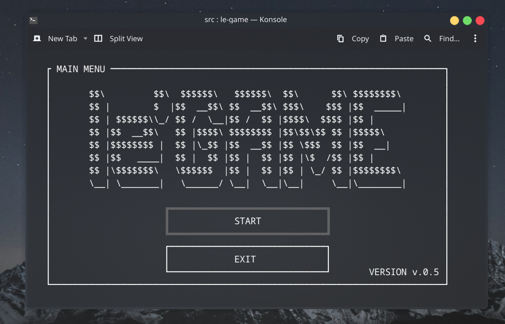

</img>

# **le'Game: a TUI Game Centre**

## What is le'Game

le-Game is my first project on TUI  and also my biggest project up today. (yes I do not have much projects.)

Althought it is not finished yet I wanted to shared with you.

Currently I have only 1 game inside the program but I want to take this number up to 3 or more.

#### Before going any further I must warn you:

#### **This program only works on Linux (and UNIX based OSs I think)**

(Maybe you can run with WSL on Windows)

Who knows maybe this will be an opportunity for you to start using Linux.

## How to install

first download dependencies:

    sudo dnf ncurses ncurses-devel -y

Clone this repo:

    git clone
    cd le-game/src

Compile the program:

    mkdir -p ../bin
    g++ *.h *.cpp -o ../bin/le-game -lncursesw && .

(I do not have makefile yet but I will add later)

Enjoy:

    cd ..
    ./bin/le-game

Now you can move the program wherever you want. (/usr/bin, /etc, /home/bin ...)

### Please feel free to share your thoughst and suggestions.